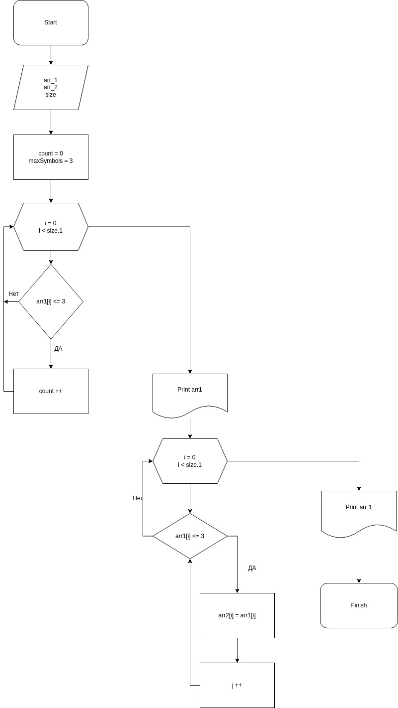

**Задача** : Написать программу, которая из имеющегося массива строк формирует новый массив из строк, длина которых меньше, либо равна 3 символам. Первоначальный массив можно ввести с клавиатуры, либо задать на старте выполнения алгоритма. При решении не рекомендуется пользоваться коллекциями, лучше обойтись исключительно массивами.  
**Инструкция**:  
* *1-*  Выводим запрос на ввод количества элементов массива(size)  
* *2-*  Пользователь заполняет массив с клавиатуры.  
* *3-* Задаем массив arr1 размером size.  
* *4-* Задаем переменную i (индекс элемента).  
* *5-* Вводим переменную count (счетчик элементов подходящих под условие).  
* *6-* Выводим на экран полученный массив arr1.  
* *7-* Вводим переменную maxSymbols (максимально допустимое количество символов в элементе). По условию maxSymbols = 3.  
* *8-* Вводим элементы массива начиная с первого arr1[0], до тех пор, пока индекс [i] меньше длины массива size, прибавляя по одному.  
* *9-* Каждый элемент массива проверяем по условию: длинна элемента arr[i] <= maxSymbols. Если условие соблюдено, увеличиваем count на один. Если нет - переходим к проверке следующего элемента массива arr1[i+1].  
* *10-* Заполняем новый массив arr2 в пределах цикла. Для этого повторно проводим проверку каждого элемента массива, чтобы длина элемента arr1[i] была больше или равна maxSymbols. Если условие соблюдено, элементу arr2[j] присваиваем соответствующее значение элемента arr1[i]. Записываем его в массив arr2. Если нет, переходим к проверке следующего элемента arr1[i+1].  
* *11-* Выводим полученный массив arr2 на экран.  
* *12-* *Блок-схема к инструкции*  

